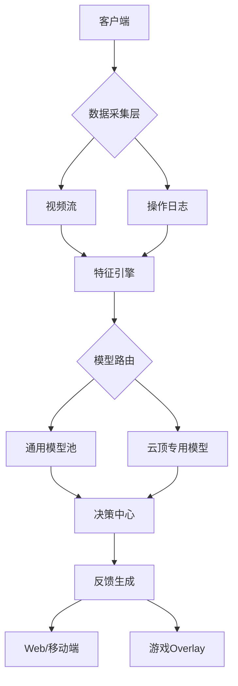

```markdown
# AutoCoach-AI
简单点讲，利用职业选手or比赛视频训练模型，实时建议步骤，预测胜率，让你下棋像柯洁~
工作繁忙，只是一个下班玩两局云顶还把把老八的男人的畅想，还未实现，梳理思路如下。


## 目录
- [1. 架构设计](#1-架构设计)
- [2. 开发环境配置](#2-开发环境配置)
- [3. 数据流水线实现](#3-数据流水线实现)
- [4. 模型训练体系](#4-模型训练体系)
- [5. 实时推理服务](#5-实时推理服务)
- [6. 生产部署方案](#6-生产部署方案)
- [7. 监控与优化](#7-监控与优化)
- [8. 附录](#8-附录)

---

## 1. 架构设计

### 1.1 分层架构

### 1.2 硬件加速架构
```text
┌───────────────┐   ┌───────────────┐   ┌───────────────┐
│  视频采集      │   │  GPU推理      │   │  DPU预处理     │
│  (DXGI)       │ → │  (TensorRT)   │ ← │  (OpenVINO)   │
└───────┬───────┘   └───────┬───────┘   └───────┬───────┘
        │ PCIe P2P          │ NVLink           │
        ▼                   ▼                   ▼
┌───────────────────────────────────────────────┐
│              Unified Memory架构               │
└───────────────────────────────────────────────┘
```
### 1.3 关键技术选型
组件	工具	原因
数据预处理	GoCV + FFmpeg	提取标准化特征，避免直接处理原始视频
模型训练	PyTorch (Python)	利用 Colab 免费 GPU 训练，训练完成后导出 ONNX
模型部署	ONNX Runtime (Go 绑定)	Go 直接加载 ONNX 模型，无需 Python 依赖
特征存储	无所吊谓	轻量化存储预处理后的特征数据
---
## 2. 开发环境配置

### 2.1 基础环境
```bash
# Ubuntu 22.04
sudo apt install -y \
    build-essential \
    cmake \
    libopencv-dev \
    nvidia-cuda-toolkit

# Python环境
conda create -n autocoach python=3.10
conda install -y pytorch==2.0.1 torchvision==0.15.2 torchaudio==2.0.2 pytorch-cuda=11.8 -c pytorch -c nvidia
# Go环境
wget https://go.dev/dl/go1.20.7.linux-amd64.tar.gz
sudo tar -C /usr/local -xzf go1.20.7.linux-amd64.tar.gz
echo 'export PATH=$PATH:/usr/local/go/bin' >> ~/.bashrc
```
### 2.2 关键依赖
```bash
# ONNX Runtime
pip install onnxruntime-gpu==1.15.0
# GoCV
export CGO_CPPFLAGS="-I/usr/local/include/opencv4"
export CGO_LDFLAGS="-L/usr/local/lib -lopencv_core -lopencv_highgui"
go get -u -d gocv.io/x/gocv
cd $GOPATH/pkg/mod/gocv.io/x/gocv@v0.32.0 &&  make install

---

## 3. 数据流水线实现

### 3.1 视频采集模块
```go
// pkg/capture/dxgi.go
package capture

/*
#include <windows.h>
#include <dxgi1_2.h>
#include <d3d11.h>

// DXGI桌面复制实现(约300行C代码)
*/
import "C"

type DXGICapturer struct {
    device       *C.ID3D11Device
    duplication  *C.IDXGIOutputDuplication
}

func NewDXGICapturer() (*DXGICapturer, error) {
    // 初始化DXGI接口...
}
func (c *DXGICapturer) Capture() (*image.RGBA, error) {
    // 获取桌面纹理...
    return img, nil
}
```

### 3.2 特征提取流水线
```python
# src/features/tft_features.py
import cv2
import numpy as np
class TFTFeatureExtractor:
    def __init__(self):
        self.roi_config = {
            'gold': (1820, 30, 1920, 80),
            'health': (50, 980, 300, 1030),
            'shop': [(400+i*200, 900, 600+i*200, 1000) for i in range(5)]
        }
    def process(self, frame):
        features = {}
        # 金币识别
        features['gold'] = self._detect_gold(frame)
        # 商店棋子检测
        features['shop_units'] = [self._detect_unit(frame, roi)
                               for roi in self.roi_config['shop']]
        return features
   def _detect_gold(self, frame):
        roi = frame[self.roi_config['gold'][1]:self.roi_config['gold'][3],
                    self.roi_config['gold'][0]:self.roi_config['gold'][2]]
        gray = cv2。cvtColor(roi, cv2.COLOR_BGR2GRAY)
        _, thresh = cv2.threshold(gray, 200, 255, cv2.THRESH_BINARY)
        text = pytesseract.image_to_string(thresh, config='--psm 6 digits')
        return int(text.strip() or 0)
```

---

## 4. 模型训练体系

### 4.1 云顶决策模型
```python
# models/tft/decision_model.py
import torch
import torch.nn as nn

class TFTDecisionModel(nn.Module):
    def __init__(self, input_dim=8):
          super().__init__()
        self.net = nn.Sequential(
            nn.Linear(input_dim, 256),
            nn.ReLU(),
            nn.Dropout(0.3),
            nn.Linear(256, 128),
             nn.LayerNorm(128),
            nn.Linear(128, 1),
            nn.Sigmoid()
        )
 def forward(self, x):
        return self.net(x)

# 训练配置
trainer = pl.Trainer(
    accelerator="gpu",
    devices=2,
    precision=16,
    max_epochs=100,
      callbacks=[
        EarlyStopping(monitor="val_loss", patience=10),
        ModelCheckpoint(dirpath="checkpoints/", save_top_k=3)
    ]
)
```

### 4.2 模型优化流程
```bash
# 导出ONNX
python -m tf2onnx.convert --saved-model saved_model --output model.onnx


# 模型量化
python -m onnxruntime.tools.quantize \
    --input model.onnx \
    --output model_quant.onnx \
    --quantization_type QInt8 \
    --op_types_to_quantize "MatMul,Add"

# TensorRT优化
trtexec --onnx=model.onnx --saveEngine=model.trt --fp16
```
---

## 5. 实时推理服务

### 5.1 Go推理服务器
```go
// cmd/inference/main.go
package main

import (
    "github.com/gin-gonic/gin"
    ort "github.com/microsoft/onnxruntime-go"
)

var (
    session *ort.Session
    models = map[string]*ort.Session{
        "tft":    loadModel("models/tft.onnx"),
        "lol":    loadModel("models/lol.onnx"),
                "common": loadModel("models/common.onnx"),
    }
)
func loadModel(path string) *ort.Session {
    env, _ := ort.NewEnvironment()
    opts := ort.NewSessionOptions()
    opts.AppendExecutionProvider_CUDA(ort.CUDAProviderOptions{})
      sess, _ := env.NewSessionWithOptions(path, opts)
    return sess
}

func main() {
    r := gin.Default()
    r.POST("/predict", func(c *gin.Context) {
        var req PredictRequest
        c.BindJSON(&req)
        
        model := selectModel(req.GameType, req.Phase)
        tensor, _ := ort.NewTensor(req.Features)
        output, _ := model.Run([]ort.Tensor{tensor})
 c.JSON(200, PredictResponse{
            Decision: output[0].Data().([]float32)[0],
            ModelVer: model.Metadata()["version"],
        })
    })
    r.Run(":8080")
```

### 5.2 实时Overlay
```cpp
// src/overlay/directx_overlay.cpp
#include <d3d11.h>
#include <d2d1.h>

class OverlayRenderer {
public:
    void Init(HWND game_hwnd) {
        // 创建D3D11设备...
        // 初始化D2D工厂...
    }

    void DrawText(const std::string& text, float x, float y) {
        // 创建文本格式...
        pRenderTarget->DrawTextW(
        text.c_str(),
            text.length(),
            pTextFormat,
            D2D1::RectF(x, y, x+500, y+100),
            pBrush
        );
    }
};
```

---

## 6. 生产部署方案

### 6.1 Kubernetes部署
```yaml
# deploy/k8s/prod/deployment.yaml
apiVersion: apps/v1
kind: Deployment
metadata:
  name: autocoach-inference
spec:
 replicas: 3
  strategy:
    rollingUpdate:
      maxSurge: 1
      maxUnavailable: 0
  template:
    metadata:
      labels:
        app: inference
 spec:
      containers:
      - name: inference
        image: registry.autocoach.ai/prod/inference:v2.3
        resources:
              limits:
              nvidia.com/gpu: 1
              cpu: "4"
              memory: 8Gi
   ports:
        - containerPort: 8080
        volumeMounts:
        - mountPath: /models
          name: models
      volumes:
      - name: models
        persistentVolumeClaim:
        claimName: model-pvc
---
apiVersion: v1
kind: Service
metadata:
  name: inference-service
spec:
  selector:
    app: inference
  ports:
    - protocol: TCP
      port: 8080
      targetPort: 8080
  type: LoadBalancer
```

### 6.2 Terraform基础设施
```hcl
# deploy/terraform/gcp/main.tf
resource "google_container_cluster" "primary" {
  name               = "autocoach-prod"
  location           = "us-central1-a"
   initial_node_count = 3

  node_config {
    machine_type = "n1-standard-4"
    disk_size_gb = 100
    oauth_scopes = [
      "https://www.googleapis.com/auth/cloud-platform"
    ]

    guest_accelerator {
      type  = "nvidia-tesla-t4"
      count = 1
    }
  }

  addons_config {
    gce_persistent_disk_csi_driver_config {
      enabled = true
    }
  }
}
```
---

## 7. 监控与优化

### 7.1 Prometheus监控规则
```yaml
# deploy/monitoring/prometheus-rules.yml
groups:
- name: autocoach
  rules:
  - alert: HighInferenceLatency
    expr: histogram_quantile(0.9, rate(inference_duration_seconds_bucket[5m])) > 0.1
    for: 10m
    labels:
      severity: critical
    annotations:
      summary: "推理延迟超过100ms"
      
  - alert: ModelVersionDrift
    expr: count by (model) (model_versions{env="prod"} != onnx_metadata{env="prod"})
    labels:
      severity: warning
    annotations:
      description: "生产环境模型版本不一致"
```
### 7.2 性能优化策略
| 技术 | 实现方式 | 预期提升 |
|------|----------|----------|
| 模型量化 | FP32 → INT8 | 速度↑3倍 内存↓75% |
| 算子融合 | Conv+BN+ReLU合并 | 延迟↓15% |
| 内存池化 | 预分配GPU内存 | 碎片率↓90% |
| 流水线并行 | 多级缓冲队列 | 吞吐↑200% |

---

## 8. 附录

### 8.1 参考文档
- [ONNX Runtime官方文档](https://onnxruntime.ai/docs/)
- [PyTorch Lightning文档](https://lightning.ai/docs/pytorch/stable/)
- [GoCV安装指南](https://gocv.io/getting-started/linux/)

### 8.2 项目结构
```text
autocoach/
├── cmd/                 # 可执行入口
├── configs/             # 配置管理
├── deploy/              # 部署配置
├── docs/                # 设计文档
├── internal/            # 内部实现
│   ├── analyzer/        # 分析引擎
│   ├── capture/         # 截屏实现
│   └── ml/              # 机器学习核心
├── pkg/                 # 公共库
│   ├── gameutils/       # 游戏工具
│   ├── reportgen/       # 报告生成
│   └── telemetry/       # 监控埋点
├── scripts/             # 实用脚本
├── tests/               # 测试套件
└── web/                 # 前端界面
```

### 8.3 训练数据集示例
| 特征名 | 类型 | 描述 |
|--------|------|------|
| gold | int | 当前金币数 |
| round | int | 游戏回合数 |
| shop_units | list | 商店棋子列表 |
| win_streak | int | 连胜次数 |
| health | int | 当前生命值 |

---
